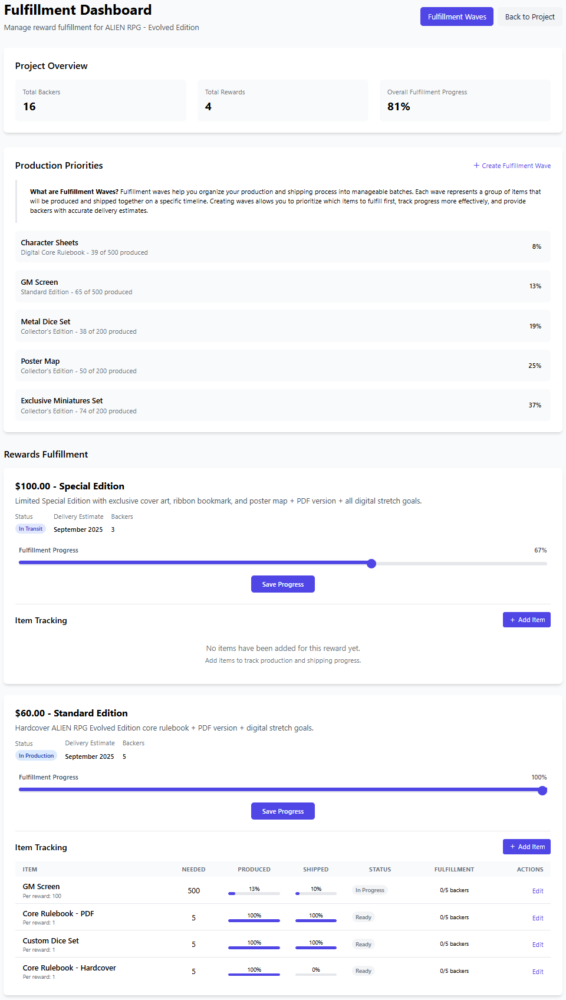

# BackerKit Clone

A functional demonstration app that simulates BackerKit's crowdfunding platform management system with a focus on partial fulfillment tracking. This application allows project creators to manage their crowdfunding campaigns and backers to pledge to projects they're interested in.

## Live Demo

Visit the live demo at: [https://backerkit-clone-ac3c300c1e50.herokuapp.com/](https://backerkit-clone-ac3c300c1e50.herokuapp.com/)

## Features

- **Project Management**: Create and manage crowdfunding projects with reward tiers
- **Backer Pledging**: Users can back projects and select rewards
- **Reward Fulfillment Dashboard**: Track and update the status of reward production and shipping
- **Partial Fulfillment System**: Manage item-level fulfillment with the following features:
  - **Fulfillment Waves**: Group items for batch production and shipment
  - **Backer-Level Tracking**: Track which items have been shipped to which backers
  - **Progress Visualization**: See fulfillment status and progress at a glance
  - **Status Variety**: Support for multiple fulfillment statuses (planned, in progress, shipping, completed)

## Feature Showcase

### Fulfillment Dashboard

The central hub for tracking and managing the entire fulfillment process:



Key features:
- Overall project fulfillment progress visualization
- Status breakdown by wave and item
- Interactive progress sliders for updating completion percentages with real-time visual feedback
- Quick access to create or modify fulfillment waves
- Status badges that clearly communicate each wave's current state

### Fulfillment Waves Management

The fulfillment waves feature enables project creators to organize their reward fulfillment process into logical batches:


Project creators can:
- Create waves for different production runs or shipping groups
- Set target shipping dates for better planning
- Track the status of each wave (planned, in progress, shipping, completed)
- Monitor progress for each wave with visual indicators
- View all waves with consistent status badges for easy visual recognition

### Wave Detail & Item Tracking

Dive deeper into individual fulfillment waves to manage specific items:


This interface allows:
- Tracking which items are included in each wave
- Updating item quantities and fulfillment status
- Managing production and shipping timelines
- Adding notes for special handling instructions
- Visualizing the progress of each item with clear percentage indicators

### Item Fulfillment Tracking

Track the production and shipping status of individual items within each reward:


Features include:
- Detailed item-by-item tracking of needed, produced, and shipped quantities
- Visual progress indicators for both production and shipping
- Status badges that update automatically based on progress
- Centralized view to identify bottlenecks in the fulfillment process

## CI/CD Pipeline & Deployment

This project implements a professional CI/CD pipeline using the same technologies as the actual BackerKit platform:

### Semaphore CI/CD

The application uses Semaphore CI for continuous integration and deployment with a multi-stage pipeline:

- **Setup**: Installs dependencies and caches them for faster subsequent builds
- **Code Quality**: Runs code linting and style checks with Rubocop
- **Tests**: Executes RSpec tests for models and controllers, including:
  - Core model functionality tests
  - Fulfillment tracking system tests
  - Controller tests for the fulfillment dashboard
- **Asset Compilation**: Verifies that assets compile successfully
- **Deployment**: Uses a promotion-based workflow to deploy to Heroku

### Heroku Deployment

The application is automatically deployed to Heroku when changes are pushed to the main branch and all tests pass:

- **Database Migrations**: Automatically run during the release phase
- **Asset Precompilation**: Handled by the Heroku Ruby buildpack
- **Environment Variables**: Managed securely through Semaphore secrets
- **Database Reset & Reseed**: Ensures demo data is fresh for demonstrations

View the Semaphore configuration in the `.semaphore` directory to see how the pipeline is structured.

## CI/CD & DevOps

- Semaphore CI/CD for continuous integration and deployment
- Heroku for cloud hosting and production deployment
- Git for version control

## Demo Accounts

All accounts use the password: `password`

### Creator Accounts

| Email | Projects |
|-------|----------|
| admin@example.com | ALIEN RPG - Evolved Edition, Animation VERSUS - Fighting Game, and more |
| sarah@example.com | Ultimate Cooking Guide, Custom Wooden Desk Organizer |
| michael@example.com | Modular Desk Lamp, Time Travel Documentary |
| emily@example.com | Pocket-Sized Adventure Camera |
| david@example.com | EcoCharge - Solar Powered Charging Station |
| jessica@example.com | Urban Perspectives - Street Art Photography Book |

### Backer Accounts

All user accounts have made pledges to various projects. To see which projects a user has backed, log in and click on "My Pledges" in the navigation menu.

## Testing the Fulfillment Dashboard

1. **Log in** with a creator account (e.g., admin@example.com)
2. Navigate to **My Projects**
3. Select a project
4. Click on the **Fulfillment Dashboard** button
5. From the dashboard you can:
   - View overall fulfillment progress
   - Create fulfillment waves
   - Update reward and item fulfillment statuses
   - Track individual backer fulfillment

### Example Fulfillment Workflow

1. Log in as `admin@example.com`
2. Go to the "ALIEN RPG - Evolved Edition" project
3. Click "Fulfillment Dashboard"
4. Explore waves with different statuses (completed, shipping, in progress, planned)
5. Update the fulfillment progress using the interactive sliders
6. View item-level tracking within each wave

## Technology Stack

- **Backend**: Ruby on Rails 7.1
- **Database**: PostgreSQL
- **Frontend**: 
  - Tailwind CSS for styling
  - Stimulus JS for interactivity
  - Hotwire for real-time updates
  - ViewComponent for reusable UI components

## Component Library

The application features a comprehensive UI component library built with ViewComponent and Stimulus.js. This modular architecture promotes consistency, reusability, and maintainability.

Visit the [Component Library](/component-library) to explore all available components.

### Key Components

- **StatusBadgeComponent**: Display status indicators with consistent styling across waves and items
- **ProgressBarComponent**: Visualize completion percentages with proper fill effects
- **ProgressSliderComponent**: Interactive fulfillment progress controls with real-time feedback
- **ModalComponent**: Accessible dialog windows
- **ToastComponent**: Temporary notification messages
- **FormErrorComponent**: Standardized form validation messages
- **FormLabelComponent**: Accessible form field labels
- **EmptyStateComponent**: Engaging placeholders for empty data states

All components follow accessibility best practices and are responsive across different screen sizes.

## Accessibility

This application adheres to WCAG accessibility standards:

- Semantic HTML structure
- ARIA attributes on interactive elements
- Keyboard navigation support
- Sufficient color contrast
- Focus management in modals and interactive components

## Code Organization

The application follows these architectural principles:

- **Components**: Reusable UI components in `app/components`
- **Controllers**: RESTful API endpoints and page controllers in `app/controllers`
- **Models**: Domain logic and data models in `app/models`
- **Views**: Page templates in `app/views`
- **Assets**: CSS, JavaScript, and images in `app/assets`
- **JavaScript**: Stimulus controllers in `app/javascript/controllers`

## Test Coverage

The application includes comprehensive test coverage for:

- **Models**: User, Project, Reward, Pledge with associated validations and methods
- **Controllers**: FulfillmentDashboard and Rewards controllers
- **Core Functionality**: Fulfillment tracking, backer management, and project status

Run the test suite with:

```bash
bundle exec rspec
```

## Local Development

### Prerequisites

- Ruby 3.3.1
- Rails 7.1.5
- PostgreSQL

### Setup

```bash
# Clone the repository
git clone <repository-url>
cd backerkit_clone

# Install dependencies
bundle install

# Setup the database
rails db:create db:migrate db:seed

# Start the server
rails server
```

## Acknowledgments

This is a demonstration application created for educational purposes. It is not affiliated with the actual BackerKit platform.
